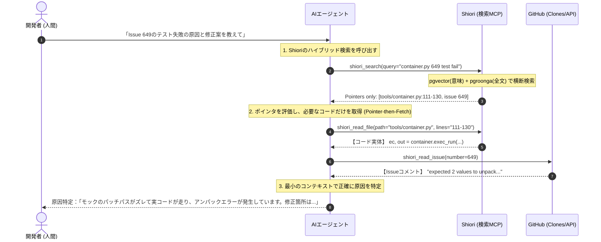

# About Shiori

AIエージェントに「一次ソースコードとIssue」のクロスリンク情報を提供する、超軽量・高精度なナレッジベース。

---

### このサイトと Shiori の関係

**Shiori（栞）自体は、ドキュメントやコラムを自動生成するシステムではありません。**  
Shiori は、AIエージェントに対してプロジェクトの「一次ソースコード」「ADR（意思決定）」「関連Issue/PR」を一本の糸で繋いだ高精度なポインタを返す **「検索・ナビゲーションMCPサーバー（裏方）」** です。

本サイトに掲載されている43本の「AI失敗学」コラムは、**Shiori のポインタ検索能力をフル活用したAIエージェント（Gemini）が、ハルシネーションを完全に排除して自律的に執筆・合成した「成果物の実例（デモギャラリー）」**です。

> **「AIに嘘を吐かせたくなければ、真実へのポインタだけを渡せ」**  
> —— Shiori が掲げる「Pointer-then-Fetch」の基本哲学

---

### AIエージェントと Shiori の連携フロー

開発者がAIに指示を出した際、エージェントはShioriをRAG of pointersとして活用し、以下のシーケンスで情報探索とコード変更を行います。



#### 🛠️ 実際のMCPツール連携イメージ (JSON)

AIエージェントは、Shioriが提供するMCPツールを以下のようにJSONプロトコル経由で呼び出し、必要な事実（ポインタ）だけをすくい取ります。

```json
// 1. まず「意味（コンセプト）」と「キーワード」で横断検索する
// Tool Call: shiori_search
{
  "query": "generator.throw database operational error",
  "repo": "masuda-masuo/sunaba"
}

// Response from Shiori (必要な情報への「ポインタ」だけを返す)
{
  "hits": [
    {
      "type": "code",
      "path": "tools/vcs.py",
      "lines": "1269-1285",
      "snippet": "def publish(repo_name, branch_name): ..."
    },
    {
      "type": "issue",
      "url": "https://github.com/masuda-masuo/sunaba/issues/42",
      "title": "Fix database lock leak on exception throw in vcs.py"
    }
  ]
}
```

---

### Shiori のコアバリュー

*   **ハイブリッド検索 (Hybrid Search)**: 単一の PostgreSQL 上で pgvector による多言語意味検索と、pgroonga による日本語検索を結合。軽量かつ高精度。
*   **クロス・リファレンス**: Issue → PR → Diff → Code の行番号に至るまで、開発プロセスの全ライフサイクルを1本に束ねて検索可能。
*   **AIファースト設計**: FastMCP 規格に準拠した13の精密なMCPツールを提供。

---

### インストール ＆ セットアップ（Coming Soon）

現在、Shiori はプライベートベータ版として開発・実走テストが行われています。  
AIエージェントの安全なオーケストレーション基盤との連携を含む「Public Release版（OSS公開）」のローンチに伴い、Docker Compose を用いた簡単なセットアップ手順をここに公開予定です。

::: details Public Release Roadmap
<div style="text-align: center; margin-top: 0.5rem;">
  <div style="display: inline-flex; align-items: center; gap: 0.5rem; font-size: 0.85rem; color: var(--vp-c-brand-1); background: rgba(0, 242, 254, 0.05); border: 1px solid var(--vp-c-brand-soft); padding: 0.5rem 1rem; border-radius: 30px;">
      <i class="fa-solid fa-code-fork"></i> Public Release Roadmap under construction
  </div>
</div>
:::
